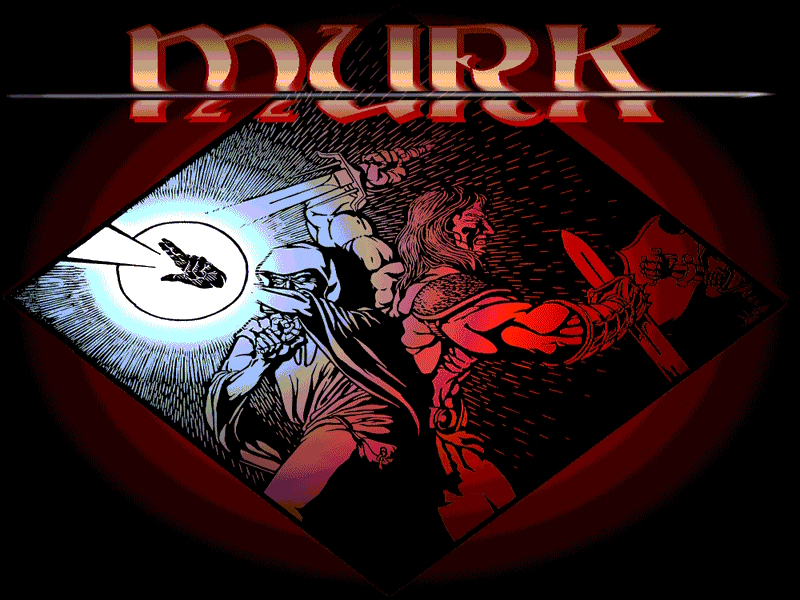
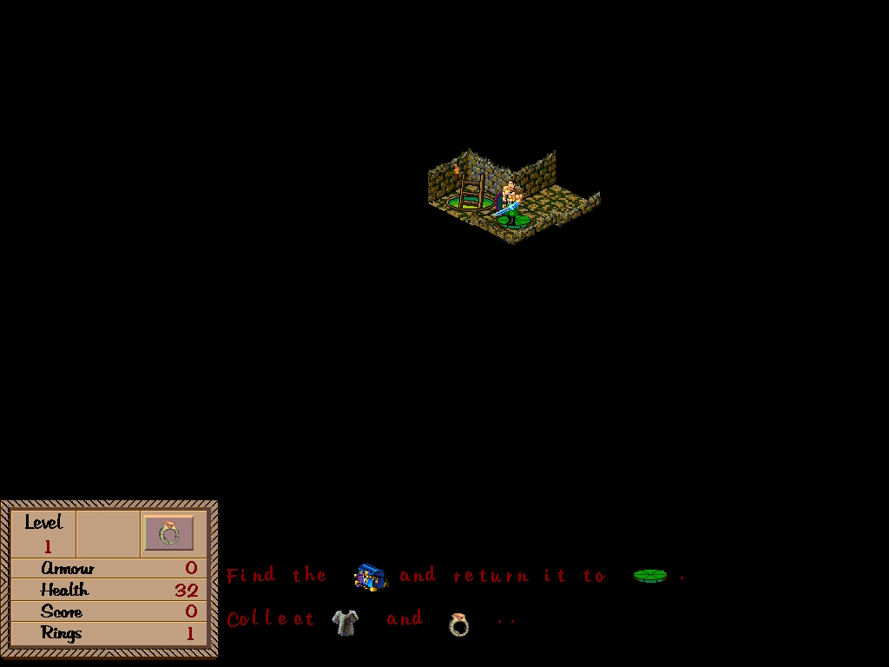
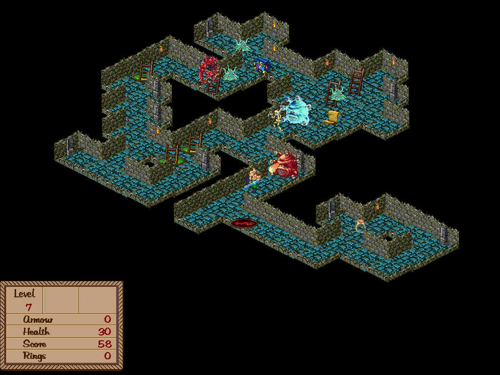
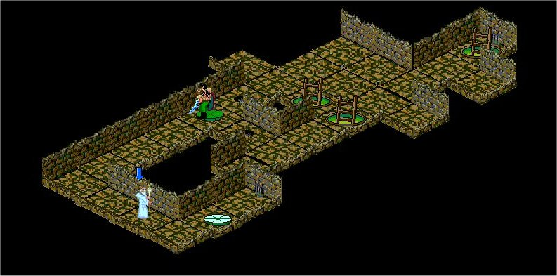
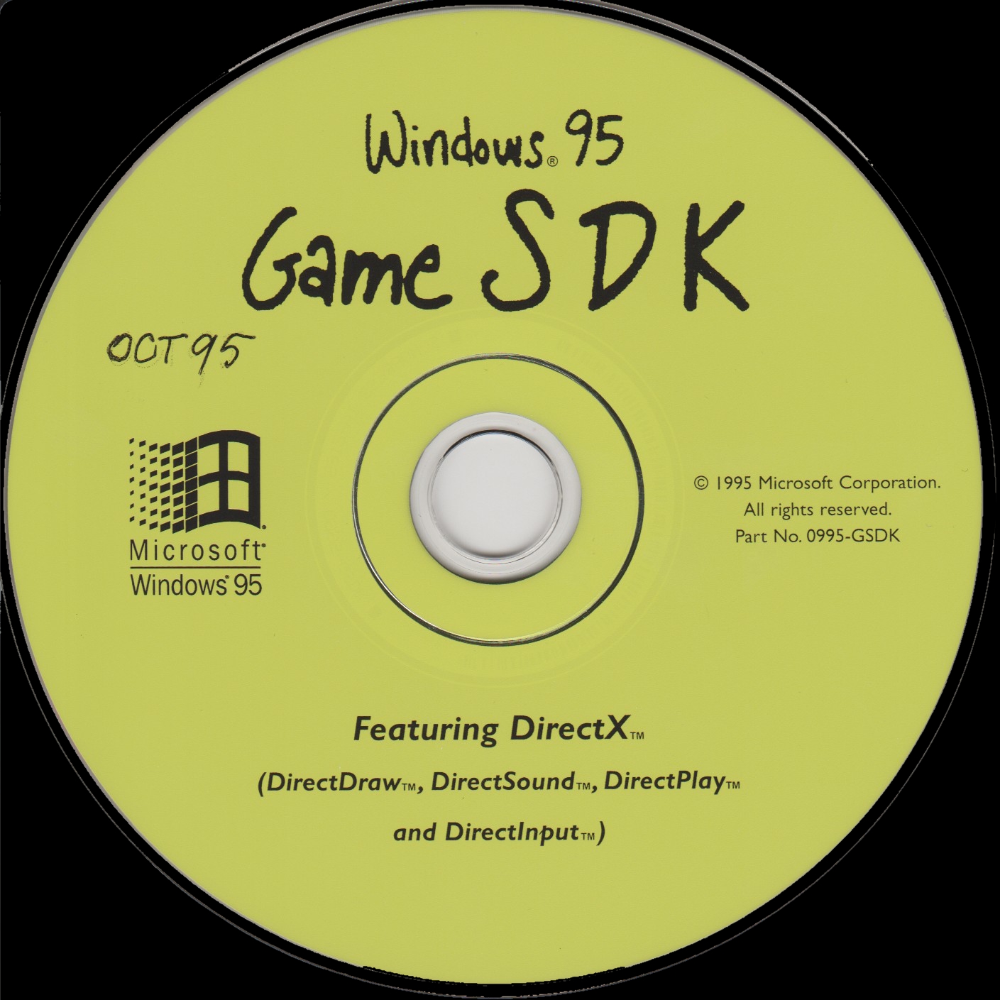
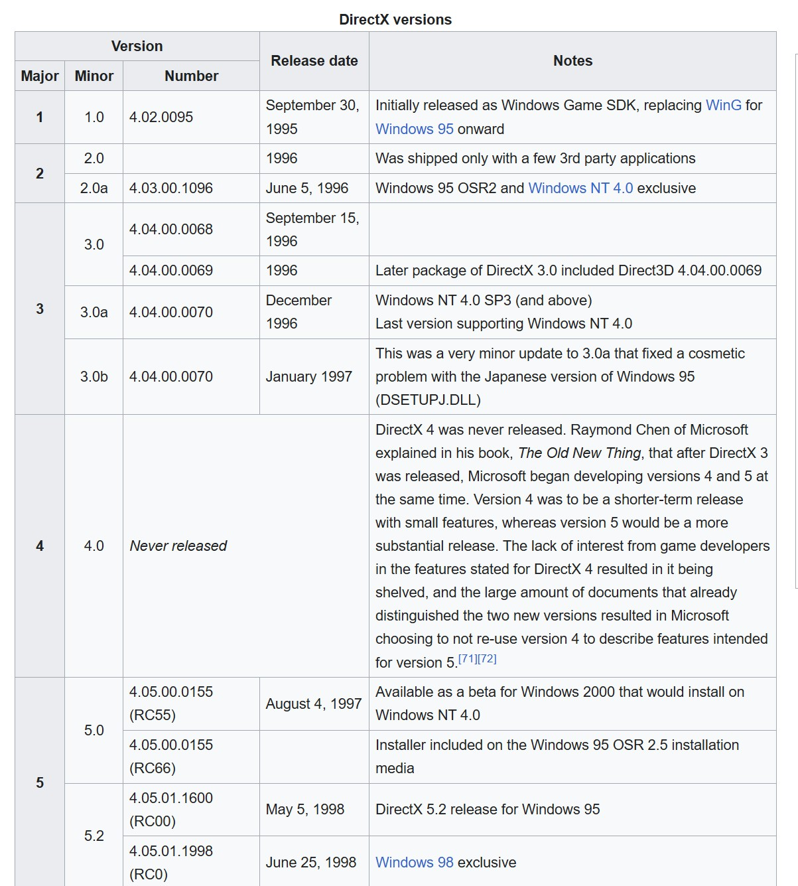

# Murk

Murk is a 1998 2D isometric dungeon crawler by Mark Longo, now preserved as a buildable Windows source release. It is a fast, arcade-style fantasy action game built with Win32, MFC, DirectDraw, DirectSound, and legacy DirectPlay-era networking code.

If you are interested in retro game development, Windows 95 game programming, early DirectX history, or playable open-source dungeon games, Murk is a compact and useful codebase to explore.

## Why Murk Stands Out

- Original late-1990s Windows game source, updated to build in Visual Studio 2022
- Playable on modern Windows systems from the included binary in `bin/`
- Isometric dungeon exploration with shooting, treasure, traps, and item pickups
- Built with classic Microsoft game tech: DirectDraw, DirectSound, DirectPlay, Win32, and MFC
- Useful reference project for retro game preservation and DirectX-era programming patterns

## Quick Facts

| Item | Details |
| --- | --- |
| Genre | Arcade-style isometric dungeon crawler |
| Original release era | 1998-1999 |
| Language | C++ |
| Graphics/API | DirectDraw |
| Audio/API | DirectSound, MIDI |
| Networking | Legacy DirectPlay support in source |
| Build target | Win32 |
| License | MIT |

## Screenshots

## Play Murk

To try the game immediately:

1. Open the `bin/` folder.
2. Run `Murk.exe`.

The bundled executable is intended to run on current Windows versions, including Windows 10 and Windows 11.

## Gameplay

Murk was originally described as a standalone or networkable arcade quest game. You choose a character, descend into the dungeon, fight monsters, search for treasure, collect useful items, and move between levels through stairs or ladders.

The codebase and bundled docs indicate support for:

- Single-player dungeon crawling
- Legacy network play features from the DirectPlay era
- Mouse, keyboard, and joystick input
- Save/load functionality
- Chat and mission/help screens

## Controls

### Mouse

- Left click: move
- Right click: fire
- Double left click: go up or down stairs/ladders

### Keyboard

- Arrow keys: move
- Ctrl: fire
- Shift: go up or down stairs/ladders
- R: use Ring of Protection
- T: drop treasure
- C: chat
- F1: help
- F2: episode objective
- F3: save game
- F4: load game
- F5: chat

### Joystick

- D-pad / stick: movement
- Button 1: shoot
- Button 2: up/down stairs
- Button 3: ring
- Button 4: drop treasure

## Build From Source

Murk can be built with Visual Studio 2022.

### Requirements

- Visual Studio 2022
- Desktop development with C++
- MFC for v143 build tools (x86 and x64)
- Windows SDK compatible with the installed Visual Studio toolset

### Build Steps

1. Open `src/Murk.sln` in Visual Studio 2022.
2. Select the `Release | Win32` configuration.
3. Build the solution.
4. The output binary is written to `bin/Murk.exe`.

## Technical Notes

This repository is especially relevant if you want to study how older Windows games were structured before modern engines became dominant.

Areas of interest include:

- DirectDraw-based 2D rendering
- DirectSound and MIDI playback
- Win32 application structure and message handling
- MFC-era project setup and resource management
- DirectPlay-era multiplayer code and dialogs
- Asset-driven game logic in a compact C++ codebase

## Repository Layout

- `src/`: C++ source, headers, Visual Studio solution, resources
- `bin/`: runnable binary, config files, save data, bundled documentation
- `artwork/`: screenshots, scans, and promotional images
- `sound/`: audio assets

## Historical Context

Murk comes from the Windows 95 PC game era, when developers commonly shipped custom engines directly on top of DirectX. That makes this repository useful not only as a playable game, but also as a small historical reference for late-1990s Windows game development.

	

	

## License

This project is released under the MIT License. See `LICENSE` for details.

